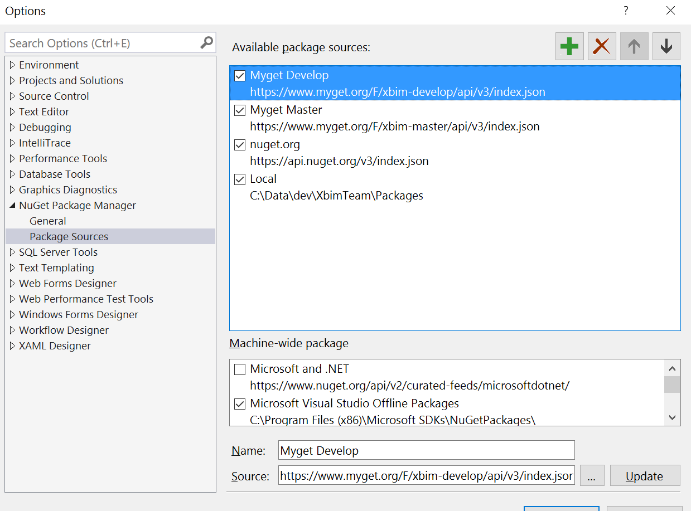
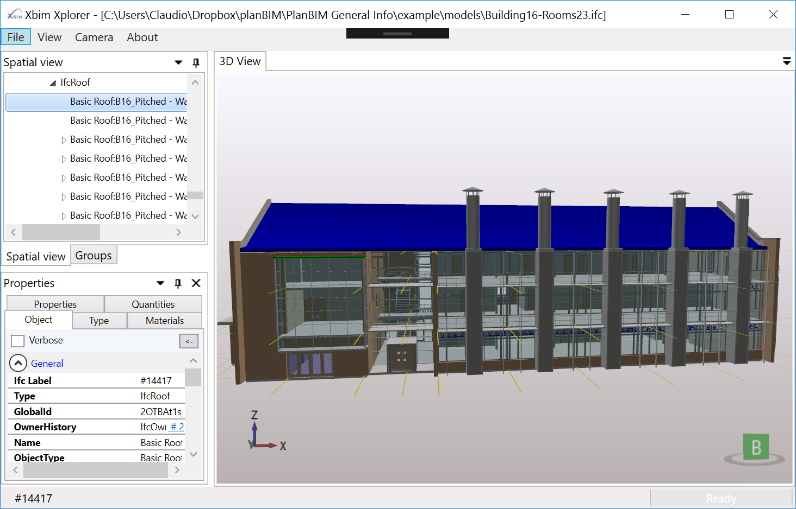

# XbimWindowsUI

Build Status (master branch): [ ,branch:(name:master)/statusIcon "Build Status") ](http://xbimbuilds.cloudapp.net/project.html?projectId=Xbim_XbimWindowsUi&tab=projectOverview "Build Status")

Build Status (develop branch): [ ,branch:(name:develop)/statusIcon "Build Status") ](http://xbimbuilds.cloudapp.net/project.html?projectId=Xbim_XbimWindowsUi&tab=projectOverview "Build Status")

## Compilation
The toolkit uses the Nuget technology for the management of several packages.
We have custom nuget feeds for the master and develop branches of the solution.
Nuget can download all the required dependencies for you if you have the correct package source configuration.

if you use Visual Studio 2015+ add the following package sources:
https://www.myget.org/F/xbim-develop/api/v3/index.json
https://www.myget.org/F/xbim-master/api/v3/index.json

if you use Visual Studio 2012+ add the following package sources:
https://www.myget.org/F/xbim-develop/api/v2
https://www.myget.org/F/xbim-master/api/v2

the resulting configuration pages looks like this in VS2015:

## Solution Content
Xbim.Presentation is the home of the XbimXplorer application and of a number of WPF components for your desktop BIM applications.

## Acknowledgements
The XbimTeam wishes to thank [JetBrains](https://www.jetbrains.com/) for supporting the XbimToolkit project with free open source [Resharper](https://www.jetbrains.com/resharper/) licenses.

[![ReSharper Logo]](ReadmeResources/icon_ReSharper.png)](https://www.jetbrains.com/resharper/)
